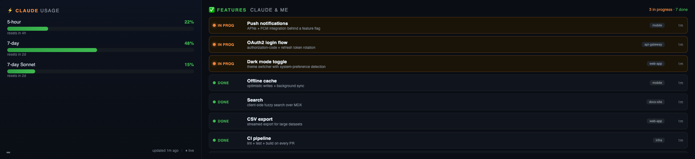

# Pi Viz Dashboard

A self-hosted, always-on dashboard for a Raspberry Pi driving a wall-mounted touchscreen.
The first board shows **live Claude usage** alongside an **auto-populated, status-tagged log
of features** you've shipped — extracted from your Claude Code transcripts with **no API key**.
Built as a swipeable multi-board carousel so you can add more boards over time.



*Live at 1920×440 (an ultra-wide "strip" panel): Claude usage on the left, a scrollable
feature log on the right. Swipe to switch boards; an auto-dimming menu (lower-left) toggles
auto-cycle. Demo data shown.*

---

## Highlights

- **Live quota** — polls Anthropic's `oauth/usage` endpoint with the Pi's own Claude login and
  auto-refreshes the token. Renders whichever windows your plan exposes (5-hour, 7-day, model
  sub-limits, credits).
- **Auto feature log, no API key** — a job rsyncs your Claude Code transcripts to the Pi, which
  extracts completed/in-progress features locally via `claude -p` (your subscription, not
  pay-as-you-go). Dedupes and infers the project name.
- **Self-maintaining status** — Claude can emit `▶`/`✅` lifecycle markers (a one-line convention);
  optional per-machine hooks push them to the Pi in real time. Idle features auto-close
  (reversibly) and a retention sweep prunes old ones, so the board stays accurate without manual
  upkeep. Works across **multiple dev machines** — each syncs into its own subdir.
- **Multi-board carousel** — swipe (or use a phone) to switch boards; auto-hiding dot indicator;
  optional timed auto-cycle with a countdown bar. Ships with one board; adding another is
  appending a module.
- **Phone control** — a small `/control` page mirrors the on-screen menu (cycle, interval,
  next/prev) and stays in sync with the wall.
- **Touch-friendly** — custom pointer-based drag-to-scroll and drag-to-switch (the cheap strip
  panels often register as a mouse, so native touch scrolling doesn't fire).

## How it works

```
  YOUR MAC (launchd, every 20 min)            THE PI (always on)
  rsync ~/.claude/projects/*.jsonl  ───────▶   ~/claude-projects/      FastAPI :8080
        (dumb file copy, no key)                     │                 ├─ GET/POST /api/features
                                                     ▼                 ├─ GET/POST /api/display
                                          viz-scanner.timer (20 min):  ├─ GET  /api/quota (cached)
                                           read transcripts            ├─ GET  /         (wall page)
                                           → claude -p extract          └─ GET  /control  (phone)
                                           → POST localhost            quota poller → oauth/usage
                                                                        (the Pi's own claude login)
```

The data is *born* on the machine you run Claude Code on, so a tiny sync ships it to the Pi; the
Pi does the rest and is otherwise self-standing.

## Feature status: markers, hooks & lifecycle

Features reach the board three redundant ways, and their status stays true on its own:

- **Markers (recommended).** Add a short convention to your `~/.claude/CLAUDE.md` so Claude emits a
  one-line marker when it starts/finishes a feature:
  ```
  When you begin substantive work on a named feature, emit on its own line:
    ▶ feature start — <project-slug>: <Feature name>
  When it is completed AND verified, emit:
    ✅ feature done — <project-slug>: <Feature name>
  Reuse the exact <Feature name> to close the same feature.
  ```
  A deterministic parser (no LLM) turns these into authoritative status updates.
- **Real-time hooks (optional, per dev machine).** A `Stop`/`SessionEnd` Claude Code hook pushes
  markers — and a "close whatever's still open" signal when a session ends — straight to the Pi
  over SSH, so the board updates in seconds instead of waiting for the next scan. Best-effort: if
  the Pi is unreachable, the scanner recovers the same markers from the synced transcripts. Setup
  is in [`deploy/INSTALL.md`](deploy/INSTALL.md); set `VIZ_HOOK_SSH` to your Pi's SSH host.
- **Scanner + LLM (always on).** The 20-min scanner parses markers and LLM-discovers unmarked work,
  and once a session goes quiet it soft-closes any `▶` that never got a `✅`.

Status model: a feature is *open*, *assumed done* (reversible — from a session-end hook or the idle
reaper; reopens automatically if the work resumes), or *declared done* (sticky — an explicit `✅`, a
manual override, or an LLM-extracted "done"). A retention sweep deletes features idle beyond the
keep-window so the board can't grow without bound.

## Stack

- **Server (Pi):** Python, FastAPI + uvicorn, SQLite. No frontend framework — vanilla JS modules.
- **Extraction:** the locally-installed `claude` CLI in `-p` (print) mode. No `ANTHROPIC_API_KEY`.
- **Kiosk:** Chromium in `--kiosk` under labwc (Wayland) on Raspberry Pi OS.

## Repo layout

| Path | Runs on | Purpose |
|---|---|---|
| `server/` | Pi | FastAPI app, SQLite store, quota fetch/refresh/parse, static board carousel |
| `server/static/` | Pi | carousel + board modules (`boards/`), nav, menu, `/control` page |
| `scanner/` | Pi | transcript reader → markers + `claude -p` extractor → POST; quiescence soft-close, crash-safe offsets |
| `hooks/` | dev machine(s) | optional Claude Code `Stop`/`SessionEnd` hook → best-effort SSH push of markers/closes |
| `cli/log-feature` | either | manually log a feature (or override status: `--status done`) |
| `deploy/` | both | systemd units, kiosk autostart, Mac→Pi sync launchd plist, `deploy-to-pi.sh` |

## Quick start

Prereqs: a Raspberry Pi (tested on Pi 4, Raspberry Pi OS / Debian trixie, labwc) with an HDMI
touchscreen, Node + Claude Code installed and logged in on the Pi (`claude` → `/login`), and a
Mac/Linux box where you run Claude Code.

```bash
# 1. From your dev machine, deploy the server to the Pi (adapt the SSH host first — see below)
./deploy/deploy-to-pi.sh

# 2. On the Pi: enable the kiosk autostart + the feature-scanner timer (see deploy/INSTALL.md)
# 3. On your dev machine: load the transcript-sync launchd job (see deploy/INSTALL.md)
```

Full step-by-step (SSH alias, secret token, systemd units, kiosk, sync job) is in
[`deploy/INSTALL.md`](deploy/INSTALL.md). Paths in `deploy/` use `YOUR_USERNAME`/`YOUR_PI_HOST`
placeholders — adapt them to your setup.

## Configuration

| Where | Var | Purpose |
|---|---|---|
| Pi server | `VIZ_DB` | SQLite path |
| Pi server + scanner | `VIZ_TOKEN` | shared secret gating `POST /api/*` writes |
| Pi scanner | `VIZ_PI_URL` | `http://localhost:8080` |
| Pi scanner | `VIZ_PROJECTS_DIR` | where the Mac rsyncs transcripts (e.g. `~/claude-projects`) |
| dev hook | `VIZ_HOOK_SSH` | SSH host the optional feature hook pushes to (unset = hook is a no-op) |

There is **no API key** — extraction uses the Pi's own `claude login` via `claude -p`. The shared
write token lives in a gitignored `.viz-token.local` and is injected into the wall + `/control`
pages at serve time (LAN-only).

**Lifecycle tuning constants** (code, not env): `REAP_IDLE_HOURS` (12) and `PRUNE_KEEP_DAYS` (14)
in `server/app.py`; `QUIET_SECS` (1800, session-quiescence) and `MAX_AGE_DAYS` (14, a guard that
skips mining sessions older than this so a lost scan-state can't trigger a full-history re-scan)
in `scanner/scan.py`.

## Screen resolution

The dashboard is **resolution-agnostic** — the layout uses viewport units (`100vw`/`100vh`),
so it fills whatever the screen is set to. There is no resolution hardcoded in the app; you set
it at the Pi's OS level.

**Change the Pi's display mode (Raspberry Pi OS, Wayland/labwc — the default):**

- **Temporary (this session):** list modes and set one with `wlr-randr`:
  ```bash
  wlr-randr                                   # show outputs (e.g. HDMI-A-1) + available modes
  wlr-randr --output HDMI-A-1 --mode 1920x1080
  ```
- **GUI:** Preferences → *Screen Configuration*, or `raspi-config` → Display Options.
- **Persistent / force a mode at boot:** add a `video=` line to `/boot/firmware/cmdline.txt`,
  e.g. `video=HDMI-A-1:1920x1080@60`, (and/or set the KMS mode in `/boot/firmware/config.txt`).
  Replace `HDMI-A-1` with your actual output name from `wlr-randr`.

**Adapting the layout to a very different aspect ratio.** The board is tuned for an ultra-wide
~1920×440 "strip" panel. It still renders at other sizes, but for a very different aspect ratio
you may want to tweak, in `server/static/styles.css`:

- the quota/feature split — `.q { flex: 0 0 29% }` (left column width),
- the feature row height — `.row { height: 46px }`,
- font sizes throughout (they're sized for the short strip).

## Tests

```bash
python -m pytest server -q            # FastAPI + SQLite (status lifecycle, quota parse, endpoints)
python -m pytest scanner hooks -q     # transcript reader, markers, scan orchestration, hook push
```

## License

MIT — see [LICENSE](LICENSE).
